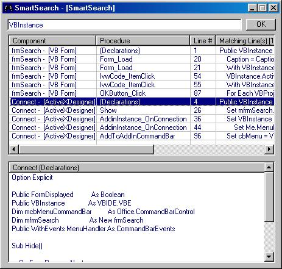



## SmartSearch

### Description

SmartSearch is a really smart ADDIN. Unlike VB's inherent find utility, SmartSearch instantly displays a list of all Lines(with the code) that contains the search text you're looking for. It goes beyond simple display and actually picks up the procedure that contains the search text and displays it right there, saving your valuable time.
 
### More Info
 

             |
---                |---
**Submitted On**   |2004-06-15 09:42:14
**By**             |[Manoz Shrivastava](https://github.com/Planet-Source-Code/PSCIndex/blob/master/ByAuthor/manoz-shrivastava.md)
**Level**          |Intermediate
**User Rating**    |5.0 (65 globes from 13 users)
**Compatibility**  |VB 6\.0
**Category**       |[Miscellaneous](https://github.com/Planet-Source-Code/PSCIndex/blob/master/ByCategory/miscellaneous__1-1.md)
**World**          |[Visual Basic](https://github.com/Planet-Source-Code/PSCIndex/blob/master/ByWorld/visual-basic.md)
**Archive File**   |[SmartSearc1757886162004\.zip](https://github.com/Planet-Source-Code/manoz-shrivastava-smartsearch__1-54413/archive/master.zip)

